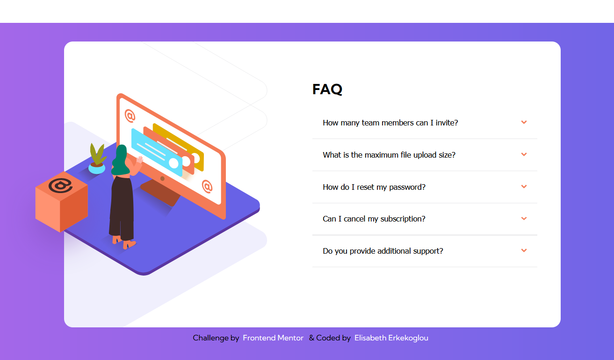
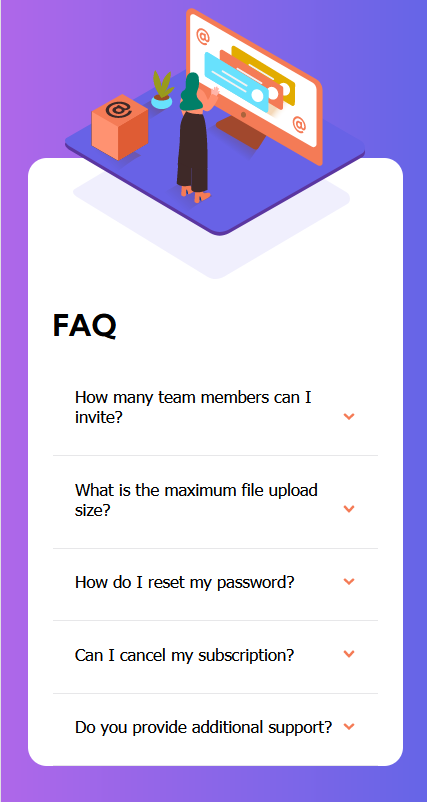

# Frontend Mentor - FAQ accordion card solution

This is a solution to the [FAQ accordion card challenge on Frontend Mentor](https://www.frontendmentor.io/challenges/faq-accordion-card-XlyjD0Oam). Frontend Mentor challenges help you improve your coding skills by building realistic projects.

## Table of contents

- [Overview](#overview)
  - [The challenge](#the-challenge)
  - [Screenshot](#screenshot)
  - [Links](#links)
- [My process](#my-process)
  - [Built with](#built-with)
  - [What I learned](#what-i-learned)
  - [Continued development](#continued-development)
  - [Useful resources](#useful-resources)
- [Author](#author)
- [Acknowledgments](#acknowledgments)

## Overview

### The challenge

Users should be able to:
- View the optimal layout for the component depending on their device's screen size
- See hover states for all interactive elements on the page
- Hide/Show the answer to a question when the question is clicked

### Screenshot




### Links

- Solution URL: [Github](https://github.com/elic4vet/faq-card)
- Live Site URL: [Netlify](https://fascinating-dusk-68f6ff.netlify.app/)

## My process

### Built with

- Semantic HTML5 markup
- CSS custom properties
- Flexbox
- CSS Grid
- Mobile-first workflow
- [Styled Components](https://styled-components.com/) - For styles

### What I learned

I learned more about the use of the grid and flexbox. I also learned how to use the toggle function in javascript. I also learned how to use the :before and :after pseudo elements. I also learned how to use the transform property in css.

```html
<h1>Some HTML code I'm proud of</h1>
```

```css
.active .arrow-icon {
  transform: rotate(180deg);
}
```

```js
for (i = 0; i < acc.length; i++) {
  // Loop through all accordion buttons and add event listeners to them
  acc[i].addEventListener("click", function () {
    // When the user clicks on an accordion button, toggle between hiding and showing the active panel
    // Close the current active panel
    if (currentPanel && currentPanel != this.nextElementSibling) {
      currentPanel.style.maxHeight = null;
      currentPanel.previousElementSibling.classList.remove("active");
    }

```

### Continued development

I also want to learn more about the use of the transform property in css. I also want to learn more about the use of the :before and :after pseudo elements. I also want to learn more about the use of the toggle function in javascript.

### Useful resources

- [W3schools](https://www.w3schools.com/) - This helped me for the use of the transform property in css. I really liked this pattern and will use it going forward.
- [W3schools](https://www.w3schools.com/) - This helped me for the use of the :before and :after pseudo elements.
- [W3schools](https://www.w3schools.com/) - This helped me for the use of the toggle function in javascript.

## Author

- Website - [Elisabeth Erkekoglou ](https://www.linkedin.com/in/eerkekoglou/)
- Frontend Mentor - [@elic4vet](https://www.frontendmentor.io/profile/elic4vet)
- Instagram - [@elisa.codes23](https://www.instagram.com/elisa.codes23/)
